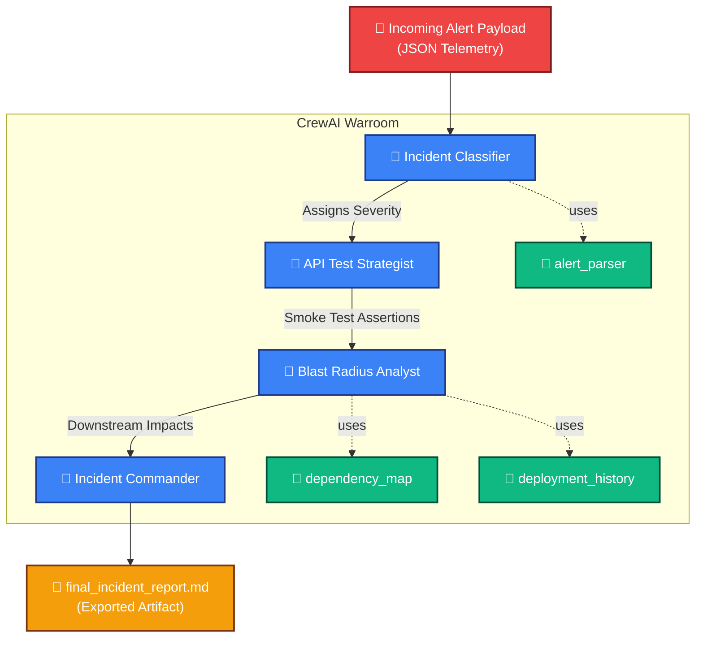

# 🛡️ PD API Health Check Warroom (CrewAI)

An automated Incident Response and SRE Warroom powered by an ensemble of autonomous AI agents using **CrewAI** and **Groq LLM (`llama-3.3-70b-versatile`)**. 

When a severe telemetry alert triggers (e.g., latency spikes, high error rates on a backend API), this application spins up a tactical AI Crew to automatically:
1. **Classify** the incident severity (P0-P4).
2. **Map** the dependency blast radius to spot cascading failures.
3. **Strategize** Playwright-style smoke tests for immediate health validation.
4. **Compile** a finalized, actionable markdown incident report.

## 🏗️ Architecture & Workflow Diagram



## 👥 The Agent Crew
* **Incident Classifier:** Expert SRE tasked with evaluating payload severity metrics. 
* **API Test Strategist:** QA Architect formulating specific `expect(status)` automated checks.
* **Blast Radius Analyst:** Distributed Systems specialist extracting associated nodes impacted down the dependency tree.
* **Incident Commander:** Consolidates all metrics into a rigid JSON structure outputted to human responders.

## 🚀 How to Run the Project

### 1. Prerequisites
Ensure you have Python 3.10+ installed along with the required libraries. Install dependencies via pip if you haven't already:
```powershell
pip install crewai python-dotenv pydantic pytest
```

### 2. Environment Variables
In the root directory of this project, you must have a `.env` file containing your valid Groq API authentication. Open or create `.env` and configure:
```env
GROQ_LLM_KEY=gsk_your_actual_key_here
GROQ_API_KEY=gsk_your_actual_key_here
```
*(Note: Both variables are recommended to prevent fallback authentication overrides inside the sub-libraries).*

### 3. Run the Main Application
To trigger the mock `/payments` API alert and spawn the war room, execute `main.py` from your terminal. 

*(Note for Windows Users: We recommend passing UTF-8 to prevent terminal character encoding errors when CrewAI prints emojis).*
```powershell
$env:PYTHONUTF8=1; python main.py
```
**Output:** Upon successful run, a file named `final_incident_report.md` will be directly generated in your root directory containing the team's resolution analysis.

### 4. Run the Test Suite
The project includes a full testing suite verifying configuration mappings, tool parsing logic, and end-to-end integration mapping.

To execute the test suite:
```powershell
$env:PYTHONUTF8=1; pytest test_agents.py test_tools.py test_integration.py -v -s
```
*(Check `full_test_suite_report.md` or `integration_test_report.md` inside your directory for expected run outputs).*
